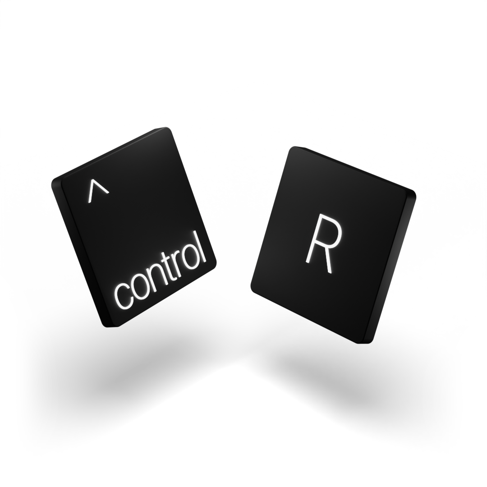

# 🌸 thingy 🌸



Listen up. **thingy** is here, and it's the toughest little blossom you'll ever cross. 👊

૮꒰ ˶• ༝ •˶꒱ა

You think pink is weak? Say that to ncurses' face. thingy is a heavyweight TUI editor packed into a tiny Sakura frame. It's built in C because we don't do that "high-level" garbage. It’s cute, it’s lethal, and it doesn’t care about your feelings.

## 🎀 The Arsenal

- **Sakura Palette**: Visual intimidation via soft pinks. It’s called psychological warfare. Look it up.
- **Aggressive Run**: Hit `^R`. thingy forces your code to execute. It doesn't ask. It commands.
- **Tactical Folds**: Hide your weaknesses. `^F` collapses code like a folding chair to the face. _(TODO: fix 🔥)_
- **The Pit**: A dedicated output panel where your errors go to die (in leaf-green, obviously).
- **Blossom Blitz**: Fast enough to flutter, hard enough to dent your terminal.

## 🌷 Deployment (Front toward enemy)

### Requirements

Get `gcc`, `make`, and `ncurses`. If you don't have them, go home.

### Installation

1.  Secure the perimeter (clone the repo).
2.  Deploy to the objective (the project folder).
3.  Forge the weapon:
    ```bash
    make
    ```
4.  Execute:
    ```bash
    ./thingy your_file.c
    ```

## 🍬 Battle Stations

| Key  | Action                                       |
| :--- | :------------------------------------------- |
| `^S` | Backup. Real warriors prepare for the worst. |
| `^R` | Launch. Let 'em have it.                     |
| `^F` | Camouflage. Hide the mess.                   |
| `^O` | Intel. See what went wrong.                  |
| `^Q` | Retreat. Live to fight another day.          |

---

### Prerequisites

You need `gcc`, `make`, and `ncurses`. Basic stuff, really. If you don't have these, maybe just use Notepad?

### Deployment

1.  Secure the perimeter (clone the repo).
2.  Deploy to the objective (the project folder).
3.  Forge the weapon:
    ```bash
    make
    ```
4.  Execute:
    ```bash
    ./thingy your_file.c
    ```

## 🍬 Battle Stations

| Key  | Action                                       |
| :--- | :------------------------------------------- |
| `^S` | Backup. Real warriors prepare for the worst. |
| `^R` | Launch. Let 'em have it.                     |
| `^F` | Camouflage. Hide the mess.                   |
| `^O` | Intel. See what went wrong.                  |
| `^Q` | Retreat. Live to fight another day.          |
